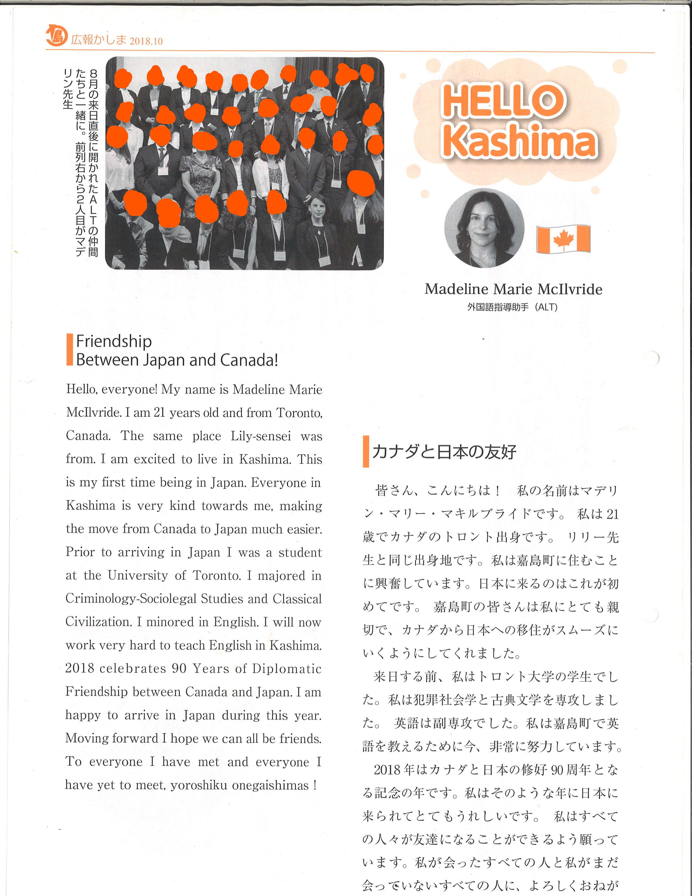

 

<body>

<a href="https://maddymao.wordpress.com/" target="_blank" style="width:100%;display:block;text-align:center;padding:.5em;background-color:#0073e2;color:#fff;border-radius:4px;box-shadow:0 4px 6px rgba(50,50,93,.11), 0 1px 3px rgba(0,0,0,.08);text-decoration:none">Back to Maddy's Homepage</a>

<h1>Introduction</h1> 

## Editions{.tabset .tabset-pills}

### October 2018

Caption: August's new arrivals after coming to Japan in a photo together. In the front row, 2nd from the left is Madeline-Sensei.

### December 2018

Caption: A delightful two-person shot with Madeline-sensei and Kumamon (?)

### January 2019

Caption: Madeline-sensei and her friends from the Assistant Language Teacher Skills and Development Conference that she participated in.

### February 2019

Caption: Madeline-sensei in absolute delight? as she visits in Okinawa sightseeing hotspot, Bios no Oka. 

### May 2019

During the spring holidays, together with the Amakusa ALTs, (Madeline-sensei) traveled to Kagoshima with Sakurajima in the background.

### Bonus: My Students won first prize (Translations by Andy).

Translations:

The Kami-Mashiki 43rd Annual Middle School English Recitation Contest took place on October 25th at the Mifune Town Cultural Center. Kashima Junior High Students from Grades 7-9 (Ages roughly around 13-16) all shined out the competition and took first place in their respective categories. Both our senior Foreign Language teachers Iwata and Fukushima (Translator’s notes: First name redacted for privacy reasons but if you can read it, good on you) along with our foreign language instructor assistant Madeline McIlvride said ‘The well-trained students believe their “extra hard work” was well worth it’. Therefore, each of the teams from our school won first place. The district-wide competition was held amongst 8 middle schools with a total of 71 students competing. The performances comprised of a skit taken from the English textbook, enacted in front of a live audience and against students from other schools. Here, they were assessed on expression and pronunciation among other things. Principal Sakuda said ‘They did really well’ when asked about the student representatives. Kashima Junior High School represented the Kami-Mashiki district at the Prefectural competition on November 13th where the 1st years came in 5th place. The winners will move onto the next stage. 
In captions: The district competition winners shine with the first years (in front), the second years (in the middle row) and third years (in the back). On the left edge of the back row is Madeline McIlvride-Sensei.

</body>
